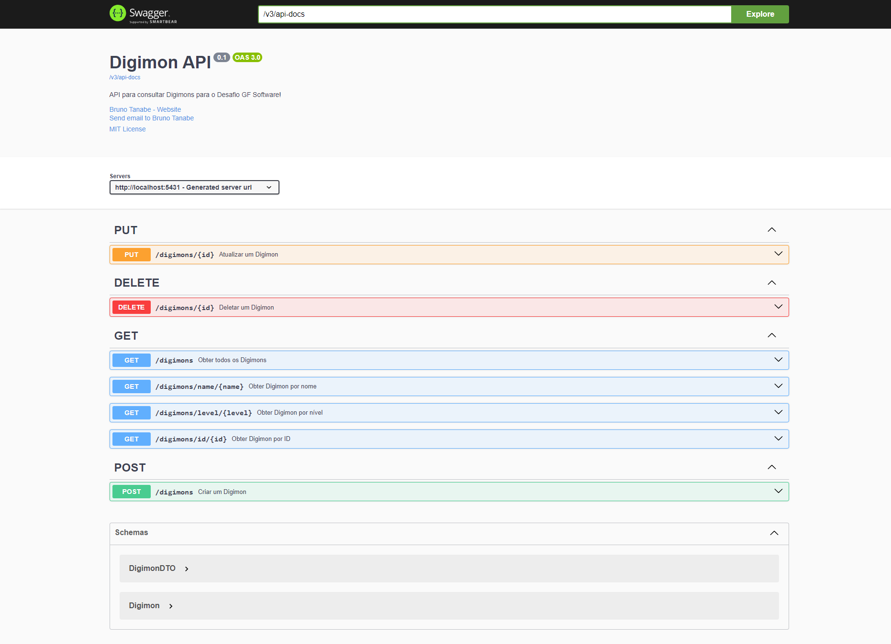

Aqui está a tradução do arquivo README.md para inglês, com pequenas melhorias para facilitar o entendimento e manter a clareza do conteúdo:

# Digimon API 🐉
Explore the digital world of Digimons through our RESTful API! 🚀 With **Digimon API**, you can easily and quickly query, add, update, and delete information about your favorite Digimons. Developed in Java with Spring Boot, this API offers well-defined endpoints, interactive documentation with Swagger, and is ready to run in any environment thanks to Docker containerization. Dive into this tech adventure and connect to the Digimon universe! 🌐

<div style="text-align: center;">
  
</div>

##### 👀 [SEE THE FULL LIST OF DIGIMONS AVAILABLE AT LAUNCH!](docs/digimon_list.md)
##### 👀 [SEE THE README IN PORTUGUESE!](README_ptbr.md)

## Table of Contents 📋
1. [Description](#1-description-📖)
2. [Objectives](#2-objectives-🎯)
3. [Main Features](#3-main-features-⚙️)
4. [Key Technologies Used](#4-key-technologies-used-🛠️)
5. [Project Structure](#5-project-structure-📁)
6. [Requirements](#6-requirements-📋)
7. [How to Run?](#7-how-to-run-▶️)
    - [7.1. Using Docker (Recommended)](#71-using-docker-recommended)
    - [7.2. Running without Docker](#72-running-without-docker)
8. [Application Images](#8-application-images)
9. [Available Endpoints](#9-available-endpoints-🚀)
10. [Future Features](#10-future-features-🔮)
11. [Frequently Asked Questions](#11-frequently-asked-questions-❓)
12. [License](#12-license-📄)
13. [How to Contribute?](#13-how-to-contribute-🤝)
14. [Author and Contact](#14-author-and-contact-👤)
15. [Special Thanks](#15-special-thanks-🌟)

## 1. Description 📖

Welcome to **Digimon API**! This is a RESTful API project developed in Java using the Spring Boot framework. The API allows you to query, insert, edit, and delete information about Digimons in a PostgreSQL database. The project follows the MVC architecture, includes Swagger documentation, and is containerized with Docker for easy execution and distribution.

## 2. Objectives 🎯

- **Learning and Practice**: Enhance skills in Java Spring Boot and RESTful API development.
- **Ease of Use**: Provide a simple and user-friendly API for interacting with Digimon data.
- **Scalability**: Build a solid foundation that can be expanded with new features in the future.
- **Best Practices**: Implement design patterns, documentation, and tests to ensure code quality.

## 3. Main Features ⚙️

- **Digimon Queries**:
    - List all Digimons.
    - Search Digimons by ID.
    - Search Digimons by name.
    - Search Digimons by level.
- **Digimon Management**:
    - Create a new Digimon.
    - Update an existing Digimon's information.
    - Delete a Digimon from the database.
- **Documentation**:
    - Access Swagger UI for route documentation and testing.

## 4. Key Technologies Used 🛠️

- **Language**: Java 17
- **Framework**: Spring Boot
- **Database**: PostgreSQL
- **Documentation**: Swagger (Springdoc OpenAPI)
- **Containerization**: Docker
- **Dependency Management**: Maven

## 5. Project Structure 📁

The project structure is as follows:

### Directory Structure

```
digimon-api/
│
├── .idea/           (IGNORED BY .GITIGNORE)
├── .mvn/
│   └── wrapper/
│       └── maven-wrapper.properties
├── developer_notes/ (IGNORED BY .GITIGNORE)
├── docs/
│   ├── images/
│   │   ├── digimon-banner.jpg
│   │   ├── digimonapi-docs.png
│   │   └── digimonapi-terminal.png
│   ├── challenge_gfinnovation.md
│   ├── commits_pattern.md
│   ├── commits_pattern_ptbr.md
│   └── digimon_list.md
├── other_codes/
│   ├── create_db.sql
│   └── digimon_list_generator.py
├── src/
│   ├── main/
│   │   └── java/
│   │       ├── com/
│   │       │   └── globalfinanceiro/
│   │       │       └── digimon_api/
│   │       │           ├── configuration/
│   │       │           │   └── SwaggerConfiguration.java
│   │       │           ├── controller/
│   │       │           │   └── DigimonController.java
│   │       │           ├── dto/
│   │       │           │   └── DigimonDTO.java
│   │       │           ├── initializer/
│   │       │           │   └── DatabaseInitializer.java
│   │       │           ├── model/
│   │       │           │   └── Digimon.java
│   │       │           ├── repository/
│   │       │           │   └── DigimonRepository.java
│   │       │           ├── service/
│   │       │           │   └── DigimonService.java
│   │       │           └── DigimonApiApplication.java
│   │       └── resources/
│   │           ├── static/
│   │           ├── templates/
│   │           ├── application.properties
│   │           ├── banner.txt
│   │           ├── digimons_data.json
│   │           └── logback-spring.xml
│   └── test/
│       └── java/
│           └── com/
│               └── globalfinanceiro/
│                   └── digimon_api/
│                       └── DigimonApiApplicationTests.java
├── target/        (IGNORED BY .GITIGNORE)
├── .gitignore
├── docker-compose.yaml
├── Dockerfile
├── HELP.md        (IGNORED BY .GITIGNORE)
├── LICENSE
├── mvnw
├── mvnw.cmd
├── pom.xml
├── README.md
└── README_ptbr.md

```

### Description

- **`.idea/`**: IntelliJ IDEA configurations (ignored by `.gitignore`).
- **`.mvn/`**: Maven Wrapper.
    - **`wrapper/`**: Maven Wrapper configurations.
        - **`maven-wrapper.properties`**: Maven Wrapper properties.
- **`developer_notes/`**: Additional developer notes (ignored by `.gitignore`).
- **`docs/`**: Project documentation.
    - **`images/`**: Images used in the documentation.
        - **`digimon-banner.jpg`**: Project banner.
        - **`digimonapi-docs.png`**: API documentation.
        - **`digimonapi-terminal.png`**: Terminal showing the running API.
    - **`challenge_gfinnovation.md`**: Challenge proposed by Global Financeiro.
    - **`commits_pattern.md`**: Commit pattern in English.
    - **`commits_pattern_ptbr.md`**: Commit pattern in Portuguese.
    - **`digimon_list.md`**: Initial list of Digimons in the project.
- **`other_codes/`**: Additional scripts used during the project.
    - **`create_db.sql`**: SQL script to create the database.
    - **`digimon_list_generator.py`**: Python script to generate the Digimon list.
- **`src/`**: Project source code.
    - **`main/`**: Main source code.
        - **`java/`**: Java source code.
            - **`com/globalfinanceiro/digimon_api/`**: Main project package.
                - **`configuration/`**: Project configurations.
                    - **`SwaggerConfiguration.java`**: Swagger configuration.
                - **`controller/`**: REST controllers.
                    - **`DigimonController.java`**: API controller.
                - **`dto/`**: DTOs (Data Transfer Objects).
                    - **`DigimonDTO.java`**: DTO for Digimons.
                - **`initializer/`**: Database initializer.
                    - **`DatabaseInitializer.java`**: Database initializer.
                - **`model/`**: Database entities.
                    - **`Digimon.java`**: Digimon entity.
                - **`repository/`**: JPA repositories.
                    - **`DigimonRepository.java`**: Digimon repository.
                - **`service/`**: Application services.
                    - **`DigimonService.java`**: Digimon service.
                - **`DigimonApiApplication.java`**: Main application class.
        - **`resources/`**: Application resources.
            - **`static/`**: Static resources.
            - **`templates/`**: HTML templates.
- **`application.properties`**: Application configurations.
- **`banner.txt`**: Startup banner.
- **`digimons_data.json`**: Initial Digimon data.
- **`logback-spring.xml`**: Logging configurations.
- **`test/`**: Test code.
- **`java/`**: Java test code.
- **`com/globalfinanceiro/digimon_api/`**: Test package.
- **`DigimonApiApplicationTests.java`**: Application tests.
- **`target/`**: Maven output directory (ignored by `.gitignore`).
- **`.gitignore`**: Git configuration file to ignore files/directories.
- **`docker-compose.yaml`**: Docker Compose configuration file.
- **`Dockerfile`**: Docker configuration file.
- **`HELP.md`**: Spring Boot help file (ignored by `.gitignore`).
- **`LICENSE`**: Project license.
- **`mvnw`**: Maven Wrapper.
- **`mvnw.cmd`**: Maven Wrapper.
- **`pom.xml`**: Maven configuration file.
- **`README.md`**: Project README file.
- **`README_ptbr.md`**: Portuguese README file.

## 6. Requirements 📋

- **Java 17** or higher.
- **Docker** and **Docker Compose** for containerization (optional but recommended).
- **PostgreSQL** (optional if using Docker).

## 7. How to Run? ▶️

Follow the steps below to run the project locally.

### 7.1. Using Docker (Recommended)

Make sure you have Docker and Docker Compose installed.

#### 1. Cloning the Repository

```bash
git clone https://github.com/BrunoTanabe/digimon-api.git
cd digimon-api
```

#### 2. Building and Starting the Containers

   ```bash
   docker-compose up --build
   ```
This command will:
- Build the Spring Boot application image.
- Pull the PostgreSQL image.
- Start both containers and set up networking between them.

#### 3. Accessing the API

The API will be available at `http://localhost:5431`.

#### 4. Accessing the Documentation

The interactive API documentation can be accessed at `http://localhost:5431/swagger-ui.html`.

### 7.2. Running without Docker

If you prefer to run the application without Docker, follow the steps below (not recommended). Ensure you have Java 17 and PostgreSQL installed.

#### 1. Cloning the Repository

```bash
git clone https://github.com/BrunoTanabe/digimon-api.git
cd digimon-api
```

#### 2. Configuring the Database

- Install PostgreSQL.
- Create a database called `digimonapi`.
- Update the connection settings in `application.properties` if necessary.

#### 3. Building the Project

   ```bash
   mvn clean package
   ```

#### 4. Running the Project

   ```bash
   java -jar target/digimon-api-0.0.1-SNAPSHOT.jar
   ```

#### 5. Accessing the API

The API will be available at `http://localhost:5431`.

#### 6. Accessing the Documentation

The interactive API documentation can be accessed at `http://localhost:5431/swagger-ui.html`.

## 8. Application Images

Once the application is running, you can view the API documentation and test the endpoints through the Swagger UI. Below are some images of the running application.

### API Documentation
<div style="text-align: center;">
  
</div>

### Terminal with the Running API
<div style="text-align: center;">
  
</div>

## 9. Available Endpoints 🚀

### GET Routes

- **`GET /digimons`**: Returns all Digimons.
- **`GET /digimons/id/{id}`**: Returns a Digimon by ID.
- **`GET /digimons/name/{name}`**: Returns Digimons matching the name.
- **`GET /digimons/level/{level}`**: Returns Digimons matching the level.

### POST Route

- **`POST /digimons`**: Creates a new Digimon.
    - **Body**:

      ```json
      {
        "name": "Digimon Name",
        "img": "Image URL",
        "level": "Digimon Level"
      }
      ```

### PUT Route

- **`PUT /digimons/{id}`**: Updates an existing Digimon.
    - **Body**:

      ```json
      {
        "name": "Updated Name",
        "img": "Updated Image URL",
        "level": "Updated Level"
      }
      ```

### DELETE Route

- **`DELETE /digimons/{id}`**: Deletes a Digimon by ID.

## 10. Future Features 🔮

- **Unit and Integration Testing**: Develop tests to ensure code quality.
- **Authentication and Authorization**: Implement security for API routes.
- **Pagination and Advanced Filters**: Enhance search functionalities.
- **Frontend**: Develop a graphical interface to interact with the API.

## 11. Frequently Asked Questions ❓

### 1. How can I contribute to the project?

See the [How to Contribute?](#how-to-contribute) section for more details.

## 12. License 📄

This project is licensed under the MIT License. See the [LICENSE](LICENSE) file for more details.

## 13. How to Contribute? 🤝

Contributions are welcome! Feel free to submit pull requests, open issues, or suggest improvements.

1. Fork the project.
2. Create a new branch: `git checkout -b feature/new-feature`.
3. Commit your changes: `git commit -m 'Add new feature'`.
4. Push to the branch: `git push origin feature/new-feature`.
5. Open a Pull Request.

## 14. Author and Contact 👤

- **Name**: Bruno Tanabe
- **Email**: [tanabebruno@gmail.com](mailto:tanabebruno@gmail.com)
- **LinkedIn**: [linkedin.com/in/tanabebruno](https://www.linkedin.com/in/tanabebruno/)

## 15. Special Thanks 🌟

I would like to express my sincere gratitude to [GF Innovation](https://www.globalfinanceiro.com.br/) for the opportunity to participate in the technical challenge and develop this project. 🚀

---