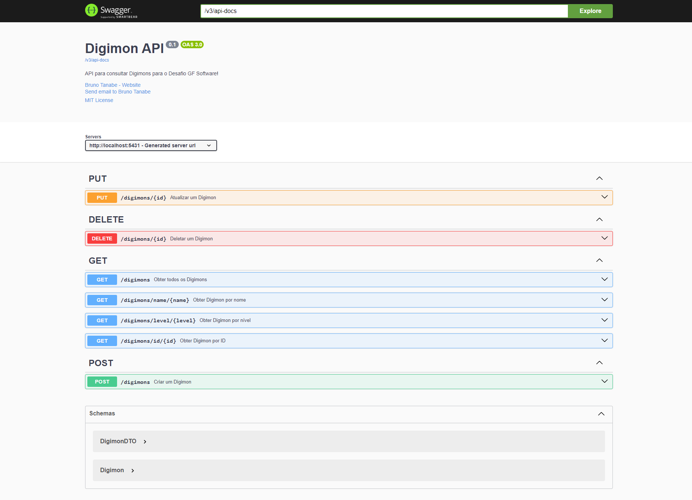
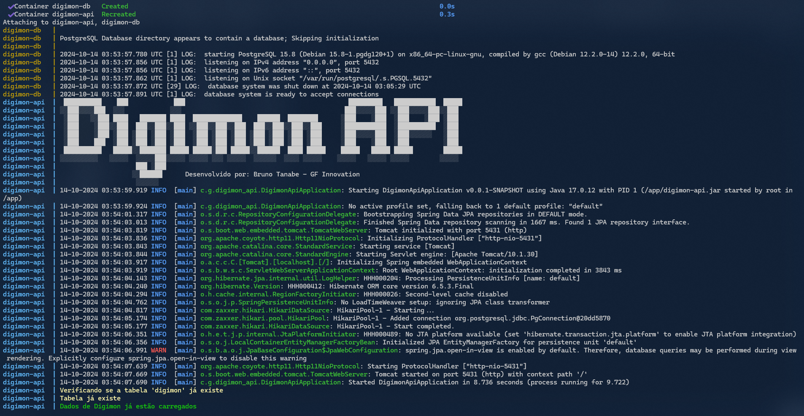

# Digimon API 🐉
Explore o mundo digital dos Digimons através da nossa API RESTful! 🚀 Com o **Digimon API**, você pode consultar, adicionar, atualizar e deletar informações sobre seus Digimons favoritos de forma fácil e rápida. Desenvolvida em Java com Spring Boot, esta API oferece endpoints bem definidos, documentação interativa com Swagger e está pronta para ser executada em qualquer ambiente graças à containerização com Docker. Mergulhe nesta aventura tecnológica e conecte-se ao universo Digimon! 🌐

<div style="text-align: center;">
  
</div>

##### 👀 [VEJA A LISTA COMPLETA DE DIGIMONS DISPONÍVEIS INICIALMENTE!](docs/digimon_list.md)
##### 👀 [VEJA O README EM INGLÊS!](README.md)


## Sumário 📋
1. [Descrição](#1-descrição-📖)
2. [Objetivos](#2-objetivos-🎯)
3. [Principais Funcionalidades](#3-principais-funcionalidades-⚙️)
4. [Principais Tecnologias Utilizadas](#4-principais-tecnologias-utilizadas-🛠️)
5. [Estrutura do Projeto](#5-estrutura-do-projeto-📁)
6. [Requisitos](#6-requisitos-📋)
7. [Como Executar?](#7-como-executar-▶️)
    - [7.1. Utilizando o Docker (Recomendado)](#71-utilizando-o-docker-recomendado)
    - [7.2. Executando sem Docker](#72-executando-sem-docker)
8. [Imagens da Aplicação](#8-imagens-da-aplicação)
9. [Endpoints Disponíveis](#9-endpoints-disponíveis-🚀)
10. [Features Futuras](#10-features-futuras-🔮)
11. [Perguntas Frequentes](#11-perguntas-frequentes-❓)
12. [Licença](#12-licença-📄)
13. [Como Contribuir?](#13-como-contribuir-🤝)
14. [Autor e Contato](#14-autor-e-contato-👤)
15. [Agradecimentos Especiais](#15-agradecimentos-especiais-🌟)

## 1. Descrição 📖

Bem-vindo à **Digimon API**! Este é um projeto de API RESTful desenvolvido em Java utilizando o framework Spring Boot. A API permite consultar, inserir, editar e deletar informações sobre Digimons em um banco de dados PostgreSQL. O projeto segue a arquitetura MVC, inclui documentação com Swagger e está containerizado com Docker para facilitar a execução e distribuição.

## 2. Objetivos 🎯

- **Aprendizado e Prática**: Desenvolver habilidades em Java Spring Boot e construção de APIs RESTful.
- **Facilidade de Uso**: Fornecer uma API simples e fácil de usar para interagir com dados de Digimons.
- **Escalabilidade**: Criar uma base sólida que possa ser expandida com novas funcionalidades no futuro.
- **Boas Práticas**: Implementar padrões de projeto, documentação e testes para garantir a qualidade do código.

## 3. Principais Funcionalidades ⚙️

- **Consulta de Digimons**:
    - Listar todos os Digimons.
    - Buscar Digimons por ID.
    - Buscar Digimons por nome.
    - Buscar Digimons por nível.
- **Manipulação de Digimons**:
    - Criar um novo Digimon.
    - Atualizar informações de um Digimon existente.
    - Deletar um Digimon do banco de dados.
- **Documentação**:
    - Acesso ao Swagger UI para documentação e testes das rotas.

## 4. Principais Tecnologias Utilizadas 🛠️

- **Linguagem**: Java 17
- **Framework**: Spring Boot
- **Banco de Dados**: PostgreSQL
- **Documentação**: Swagger (Springdoc OpenAPI)
- **Containerização**: Docker
- **Gerenciamento de Dependências**: Maven

## 5. Estrutura do Projeto 📁
A estrutura do projeto é a seguinte:

### Estrutura de Diretórios

```
digimon-api/
│
├── .idea/           (IGNORADO PELO .GITIGNORE)
├── .mvn/
│   └── wrapper/
│       └── maven-wrapper.properties
├── developer_notes/ (IGNORADO PELO .GITIGNORE)
├── docs/
│   ├── images/
│   │   ├── digimon-banner.jpg
│   │   ├── digimonapi-docs.png
│   │   └── digimonapi-terminal.png
│   ├── challenge_gfinnovation.md
│   ├── commits_pattern.md
│   ├── commits_pattern_ptbr.md
│   └── digimon_list.md
├── other_codes/
│   ├── create_db.sql
│   └── digimon_list_generator.py
├── src/
│   ├── main/
│   │   └── java/
│   │       ├── com/
│   │       │   └── globalfinanceiro/
│   │       │       └── digimon_api/
│   │       │           ├── configuration/
│   │       │           │   └── SwaggerConfiguration.java
│   │       │           ├── controller/
│   │       │           │   └── DigimonController.java
│   │       │           ├── dto/
│   │       │           │   └── DigimonDTO.java
│   │       │           ├── initializer/
│   │       │           │   └── DatabaseInitializer.java
│   │       │           ├── model/
│   │       │           │   └── Digimon.java
│   │       │           ├── repository/
│   │       │           │   └── DigimonRepository.java
│   │       │           ├── service/
│   │       │           │   └── DigimonService.java
│   │       │           └── DigimonApiApplication.java
│   │       └── resources/
│   │           ├── static/
│   │           ├── templates/
│   │           ├── application.properties
│   │           ├── banner.txt
│   │           ├── digimons_data.json
│   │           └── logback-spring.xml
│   └── test/
│       └── java/
│           └── com/
│               └── globalfinanceiro/
│                   └── digimon_api/
│                       └── DigimonApiApplicationTests.java
├── target/        (IGNORADO PELO .GITIGNORE)
├── .gitignore
├── docker-compose.yaml
├── Dockerfile
├── HELP.md        (IGNORADO PELO .GITIGNORE)
├── LICENSE
├── mvnw
├── mvnw.cmd
├── pom.xml
├── README.md
└── README_ptbr.md

```

### Descrição
- **`.idea/`**: Configurações do IntelliJ IDEA (ignorado pelo `.gitignore`).
- **`.mvn/`**: Wrapper do Maven.
    - **`wrapper/`**: Configurações do Maven Wrapper.
        - **`maven-wrapper.properties`**: Propriedades do Maven Wrapper.
- **`developer_notes/`**: Notas e anotações adicionais feitas pelo desenvolvedor (ignorado pelo `.gitignore`).
- **`docs/`**: Documentação do projeto.
    - **`images/`**: Imagens utilizadas na documentação.
        - **`digimon-banner.jpg`**: Banner do projeto.
        - **`digimonapi-docs.png`**: Documentação da API.
        - **`digimonapi-terminal.png`**: Terminal com a API em execução.
    - **`challenge_gfinnovation.md`**: Desafio proposto pela Global Financeiro.
    - **`commits_pattern.md`**: Padrão de commits em inglês.
    - **`commits_pattern_ptbr.md`**: Padrão de commits em português.
    - **`digimon_list.md`**: Lista de Digimons presentes inicialmente no projeto.
- **`other_codes/`**: Códigos adicionais utilizados durante o projeto.
    - **`create_db.sql`**: Script SQL para criação do banco de dados.
    - **`digimon_list_generator.py`**: Script Python para gerar a lista de Digimons.
- **`src/`**: Código-fonte do projeto.
    - **`main/`**: Código-fonte principal.
        - **`java/`**: Código-fonte Java.
            - **`com/globalfinanceiro/digimon_api/`**: Pacote principal do projeto.
                - **`configuration/`**: Configurações do projeto.
                    - **`SwaggerConfiguration.java`**: Configuração do Swagger.
                - **`controller/`**: Controladores REST.
                    - **`DigimonController.java`**: Controlador da API.
                - **`dto/`**: DTOs (Data Transfer Objects).
                    - **`DigimonDTO.java`**: DTO para Digimons.
                - **`initializer/`**: Inicializador do banco de dados.
                    - **`DatabaseInitializer.java`**: Inicializador do banco de dados.
                - **`model/`**: Entidades do banco de dados.
                    - **`Digimon.java`**: Entidade Digimon.
                - **`repository/`**: Repositórios JPA.
                    - **`DigimonRepository.java`**: Repositório de Digimons.
                - **`service/`**: Serviços da aplicação.
                    - **`DigimonService.java`**: Serviço de Digimons.
                - **`DigimonApiApplication.java`**: Classe principal da aplicação.
        - **`resources/`**: Recursos da aplicação.
            - **`static/`**: Recursos estáticos.
            - **`templates/`**: Templates HTML.
            - **`application.properties`**: Configurações da aplicação.
            - **`banner.txt`**: Banner de inicialização.
            - **`digimons_data.json`**: Dados iniciais dos Digimons.
            - **`logback-spring.xml`**: Configurações de logging.
    - **`test/`**: Código de testes.
        - **`java/`**: Código de testes Java.
            - **`com/globalfinanceiro/digimon_api/`**: Pacote de testes.
                - **`DigimonApiApplicationTests.java`**: Testes da aplicação.
- **`target/`**: Diretório de saída do Maven (ignorado pelo `.gitignore`).
- **`.gitignore`**: Arquivo de configuração do Git para ignorar arquivos/diretórios.
- **`docker-compose.yaml`**: Arquivo de configuração do Docker Compose.
- **`Dockerfile`**: Arquivo de configuração do Docker.
- **`HELP.md`**: Arquivo de ajuda do Spring Boot (ignorado pelo `.gitignore`).
- **`LICENSE`**: Licença do projeto.
- **`mvnw`**: Wrapper do Maven.
- **`mvnw.cmd`**: Wrapper do Maven.
- **`pom.xml`**: Arquivo de configuração do Maven.
- **`README.md`**: Arquivo README do projeto.
- **`README_ptbr.md`**: Arquivo README em português.

## 6. Requisitos 📋

- **Java 17** ou superior.
- **Docker** e **Docker Compose** para containerização. (Opcional mas recomendado).
- **PostgreSQL** (Opcional se utilizar Docker).

## 7. Como Executar? ▶️

Siga os passos abaixo para executar o projeto localmente.

### 7.1. Utilizando o Docker (Recomendado)

Certifique-se de que você tem o Docker e o Docker Compose instalados.

#### 1. Clonando o Repositório

```bash
git clone https://github.com/BrunoTanabe/digimon-api.git
cd digimon-api
```

#### 2. Construindo e Iniciando os Containers

   ```bash
   docker-compose up --build
   ```
Este comando fará o seguinte:
- Construir a imagem do aplicativo Spring Boot.
- Baixar a imagem do PostgreSQL.
- Iniciar ambos os containers e configurar a rede entre eles.

#### 3. Acessando a API

   A API estará disponível em `http://localhost:5431`.

#### 4. Acessando a Documentação

   A documentação interativa da API pode ser acessada em `http://localhost:5431/` ou `http://localhost:5431/`.

### 7.2. Executando sem Docker

Se preferir executar a aplicação sem Docker, siga os passos abaixo (não recomendado).
Certifique-se de ter Java 17 e o PostgreSQL instalados.

#### 1. Clonando o Repositório

```bash
git clone https://github.com/BrunoTanabe/digimon-api.git
cd digimon-api
```

#### 2. Configurando o Banco de Dados
- Instale o PostgreSQL.
- Crie um banco de dados chamado `digimonapi`.
- Atualize as configurações de conexão no arquivo `application.properties` se necessário.

#### 3. Construindo o Projeto

   ```bash
   mvn clean package
   ```

#### 4. Executando o Projeto

   ```bash
   java -jar target/digimon-api-0.0.1-SNAPSHOT.jar
   ```

#### 5. Acessando a API

A API estará disponível em `http://localhost:5431`.

#### 6. Acessando a Documentação

A documentação interativa da API pode ser acessada em `http://localhost:5431/` ou `http://localhost:5431/`.

## 8. Imagens da Aplicação

Caso a aplicação esteja em execução, você poderá visualizar a documentação da API e testar os endpoints através do Swagger UI. Abaixo estão algumas imagens da aplicação em execução.

### Documentação da API
<div style="text-align: center;">
  
</div>

### Terminal com a API em Execução
<div style="text-align: center;">
  
</div>

## 9. Endpoints Disponíveis 🚀

### Rotas GET

- **`GET /digimons`**: Retorna todos os Digimons.
- **`GET /digimons/id/{id}`**: Retorna um Digimon pelo ID.
- **`GET /digimons/name/{name}`**: Retorna Digimons que correspondem ao nome.
- **`GET /digimons/level/{level}`**: Retorna Digimons que correspondem ao nível.

### Rotas POST

- **`POST /digimons`**: Cria um novo Digimon.
    - **Body**:

      ```json
      {
        "name": "Nome do Digimon",
        "img": "URL da imagem",
        "level": "Nível do Digimon"
      }
      ```

### Rotas PUT

- **`PUT /digimons/{id}`**: Atualiza um Digimon existente.
    - **Body**:

      ```json
      {
        "name": "Nome atualizado",
        "img": "URL da imagem atualizada",
        "level": "Nível atualizado"
      }
      ```

### Rotas DELETE

- **`DELETE /digimons/{id}`**: Deleta um Digimon pelo ID.

## 10. Features Futuras 🔮

- **Implementação de Testes Unitários e de Integração**: Desenvolver testes para garantir a qualidade do código.
- **Autenticação e Autorização**: Implementar segurança nas rotas da API.
- **Paginação e Filtros Avançados**: Melhorar as funcionalidades de busca.
- **Frontend**: Desenvolver uma interface gráfica para interagir com a API.

## 11. Perguntas Frequentes ❓

### 1. Como posso contribuir para o projeto?

Veja a seção [Como Contribuir?](#como-contribuir) para mais detalhes.

## 12. Licença 📄

Este projeto está licenciado sob a Licença MIT. Veja o arquivo [LICENSE](LICENSE) para mais detalhes.

## 13. Como Contribuir? 🤝

Contribuições são bem-vindas! Sinta-se à vontade para enviar pull requests, abrir issues ou sugerir melhorias.

1. Faça um fork do projeto.
2. Crie uma nova branch: `git checkout -b feature/nova-funcionalidade`.
3. Commit suas mudanças: `git commit -m 'Adiciona nova funcionalidade'`.
4. Faça push para a branch: `git push origin feature/nova-funcionalidade`.
5. Abra um Pull Request.

## 14. Autor e Contato 👤

- **Nome**: Bruno Tanabe
- **Email**: [tanabebruno@gmail.com](mailto:tanabebruno@gmail.com)
- **LinkedIn**: [linkedin.com/in/tanabebruno](https://www.linkedin.com/in/tanabebruno/)

## 15. Agradecimentos Especiais 🌟

Gostaria de expressar minha sincera gratidão à [GF Innovation](https://www.globalfinanceiro.com.br/) por me proporcionar a oportunidade de participar do desafio técnico e desenvolver este projeto. 🚀

---